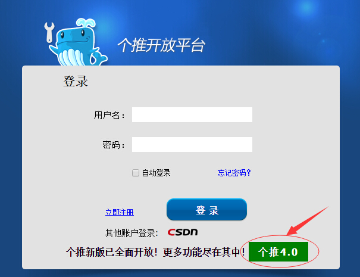
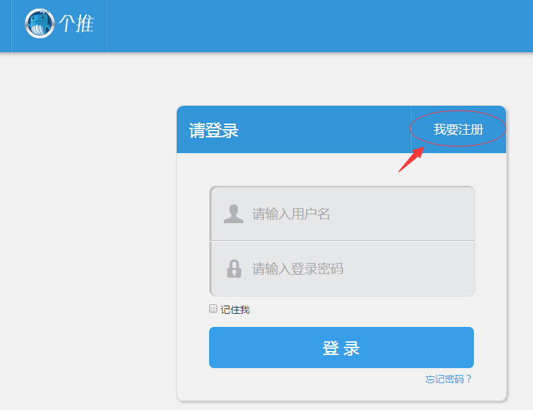
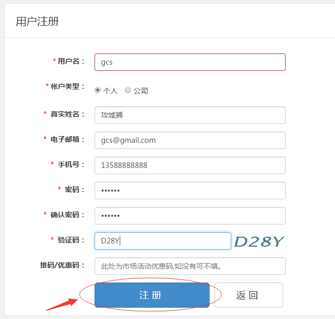
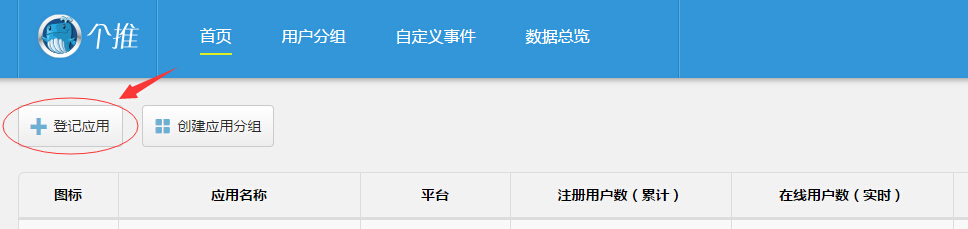
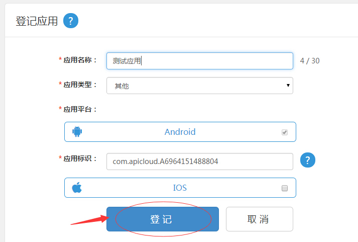
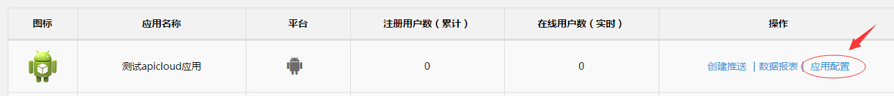
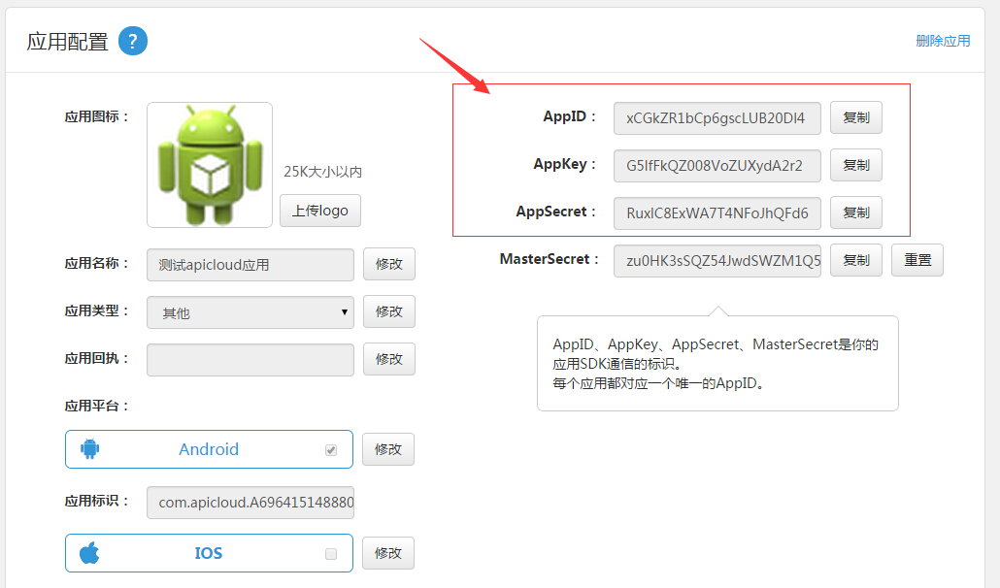
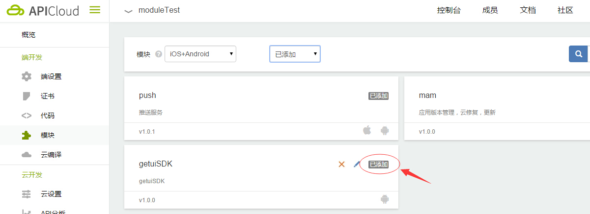
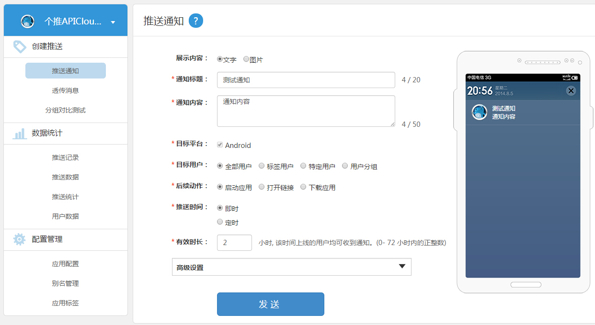
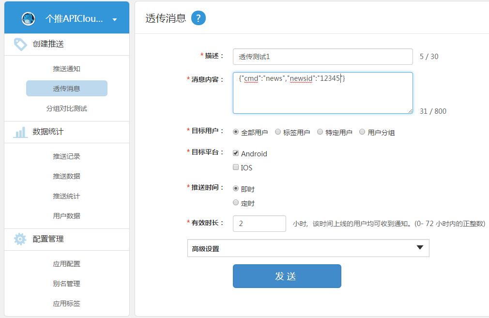

/*
Title: pushGeTui_manual
Description: pushGeTui_manual
*/

#**个推开放API配置指南**

开发者在使用 APICloud 提供的第三方开放平台-个推（pushGeTui）时，需要开发者自行到个推开放平台申请相应的AppID，并按照个推模块开发指南进行配置。

##申请步骤

- 访问个推开放平台，访问地址：http://dev.getui.com/

 

- 点击个推4.0新版入口

 

- 点击“我要注册”，填写相应的用户信息进行注册

 

- 创建推送应用

 

- 填写应用名称，填写Android应用包名。注意：APICloud应用包名命名为：com.apicloud.<ID>，<ID>为APICloud平台创建的应用ID。包名例如：com.apicloud.A6964151488804。目前暂不支持iOS平台。

 

- 查看新注册应用的应用配置

 

- 获取APPKEY/APPID/APPSECRET参数

 

- 根据pushGeTui模块集成接口文档中的流程将pushGeTui模块添加到APICloud应用中。

 

- 启动APICloud应用，初始化个推模块，推送通知测试

 

- 启动APICloud应用，初始化个推模块，推送透传消息测试

 
